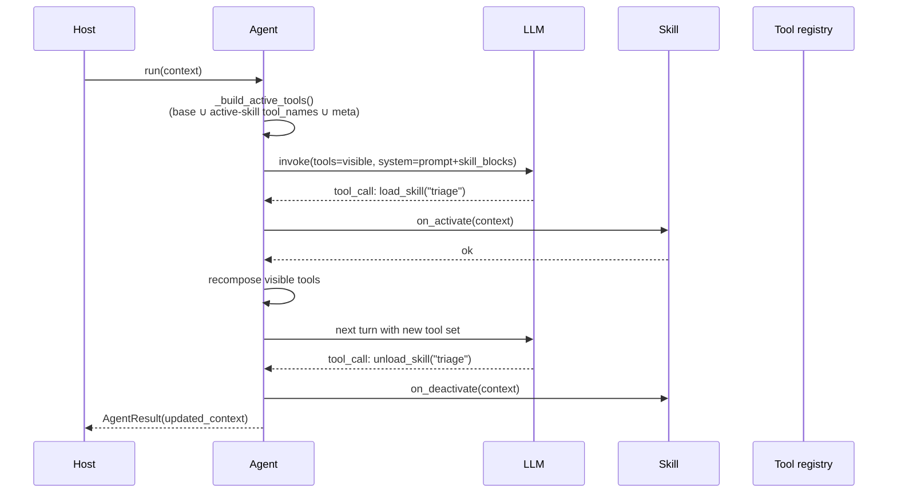

# Agent Skill Lifecycle

How skills attach/detach to an agent and how the visible tool set is recomposed each turn.

## Activation modes

- **`manual`** — host calls `await agent.activate_skill(name, context)`.
- **`llm`** (default) — agent injects `load_skill` / `unload_skill` meta-tools; the LLM decides.

## Sequence — LLM-driven activation



## Visibility rule

```
visible_tools = base_tool_names
              ∪ ⋃ skill.tool_names  (for skill in active set, in activation order)
              ∪ meta_tool_names      (only if skill_activation == "llm")
```

Dedup is name-keyed: a tool referenced by two active skills appears **once**. Order: base → active-skills-in-order → meta.

## System prompt layout (when skills registered)

```
<base_user_prompt>...role/goal/task...</base_user_prompt>

<skill_mechanism>...how skills work...</skill_mechanism>
<available_skills>            ← only in "llm" mode
- name: description
</available_skills>
<active_skills>
- name1
- name2
</active_skills>
<active_skill name="name1">instructions...</active_skill>
<active_skill name="name2">instructions...</active_skill>
```

## Invariants

- `Skill.tool_names` must all resolve in the agent's tool registry, or the skill is **dropped** at construction with a warning.
- Reserved meta-tool names `load_skill`, `unload_skill` cannot be used by user tools.
- Activation is **idempotent** — re-activating a live skill is a no-op; hooks don't re-fire.
- `on_activate` / `on_deactivate` receive `Optional[ConversationContext]` — None during agent setup, live context during a turn.

See `src/echo/agents/base.py` and `src/echo/agents/skill.py`.
