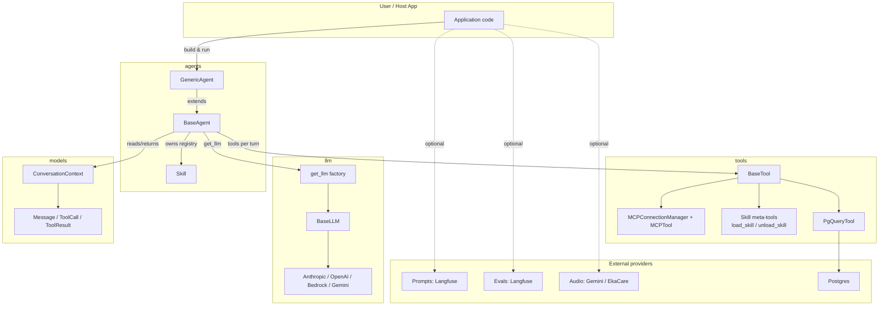

# Architecture Overview

Top-level module dependency graph for `src/echo/`.

**Read order for newcomers**: `models/` → `tools/base_tool.py` → `llm/base.py` → `agents/base.py` → one provider in `llm/` to see the agentic loop.
