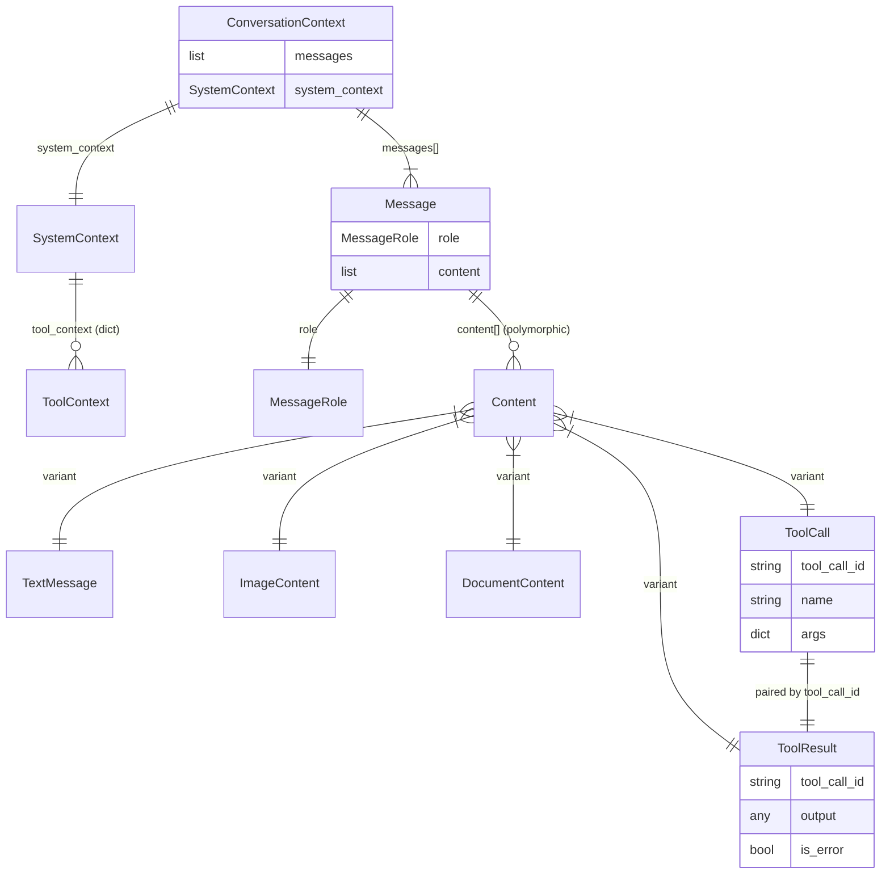

# Conversation Context — Entity Relationships

The data model for in-flight conversation state. **Immutable from the caller's perspective**: `invoke()` returns a new context; never mutate the input.

## Rules

- **Roles**: `user`, `assistant`, `system`, `tool` (see `MessageRole`).
- **Content is polymorphic**: one Message can hold text + image + document + tool_call/result in `content[]`.
- **`tool_call_id` pairs `ToolCall` ↔ `ToolResult`**. Providers rely on this for tool-use turns.
- **`SystemContext.tool_context`** carries hidden params (user_id, workspace_id, auth tokens) — merged into tool args at execution time; **not visible to the LLM**.
- **Never serialize with stdlib json** — use `orjson`. Pydantic models: `.model_dump()` then `orjson.dumps()`.

See `src/echo/models/user_conversation.py`.
