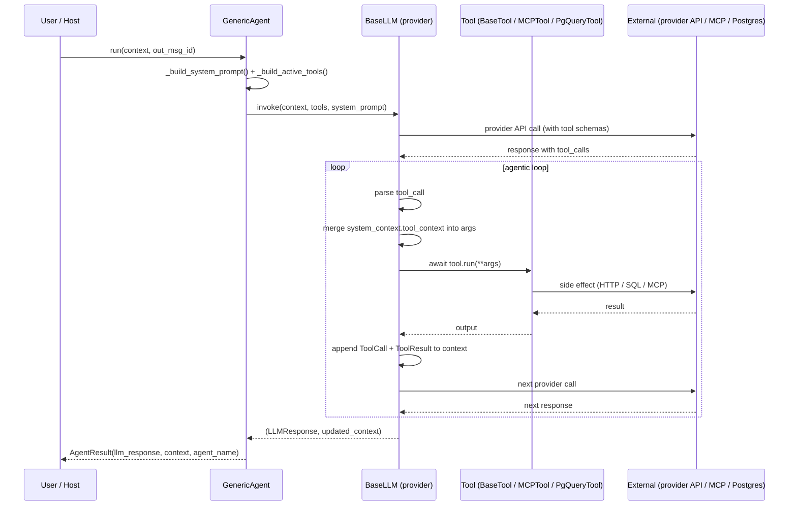

# End-to-End Data Flow

One full turn from user input to assistant response, showing every layer involved.

## Streaming variant

Replace `invoke` with `invoke_stream` and `AgentResult` with `AsyncGenerator[StreamEvent, None]`. Events: `TEXT`, `TOOL_CALL_START`, `TOOL_CALL_END`, `DONE`, `ERROR`. The terminal `DONE` event carries the complete `LLMResponse` and final `ConversationContext`.

## Where things can go wrong

| Layer | Failure mode | Surface |
|-------|--------------|---------|
| Agent | Skill tool_names unresolved | dropped at __init__ with warning |
| LLM | Provider API error | exception propagates; agent returns `AgentResult(error=...)` |
| Tool | Schema mismatch | Provider rejects call before reaching tool.run |
| MCP tool | Connection drop | `MCPConnectionError`; wrap in try/except in tool.run |
| Postgres | Pool exhausted | asyncpg error; caller's responsibility to size pool |

See `src/echo/agents/base.py:_run_agent` and `_run_agent_stream`.
