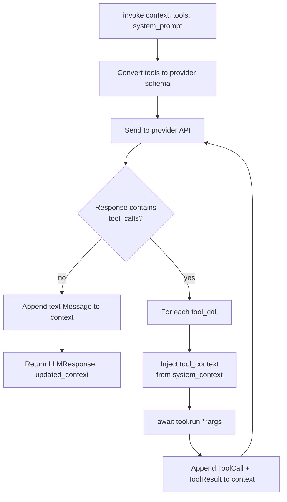
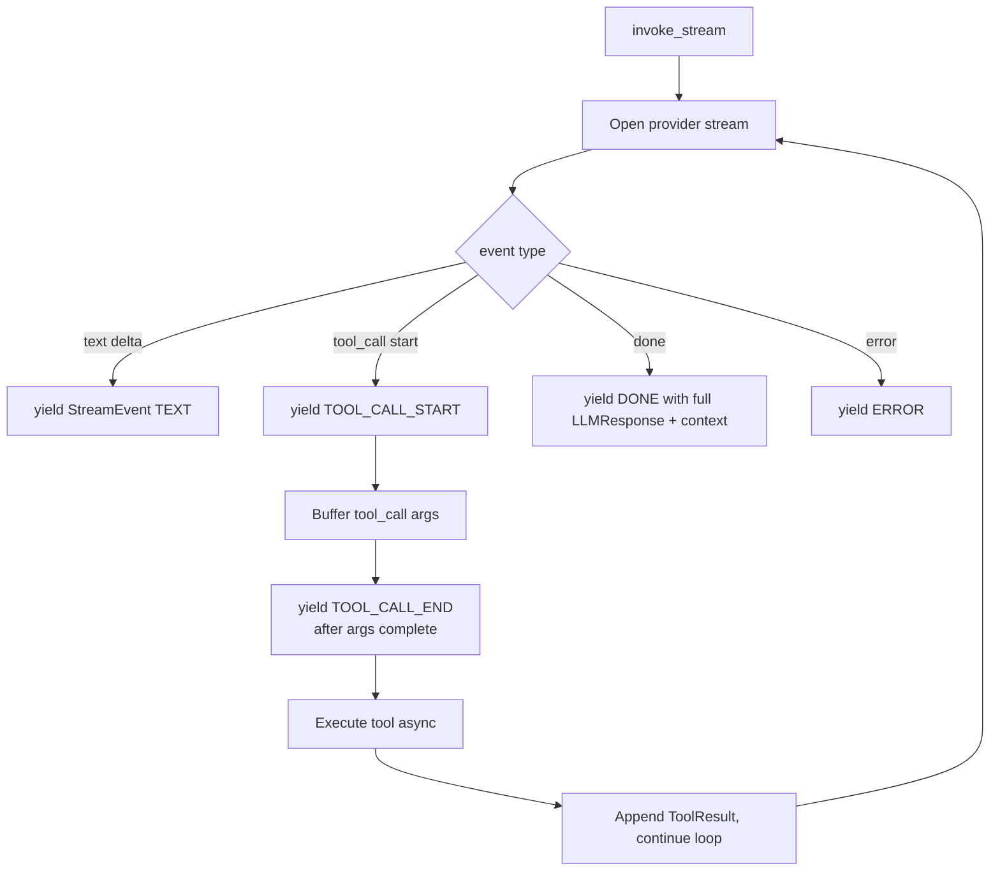

# LLM Invoke Flow

How `BaseLLM.invoke()` and `invoke_stream()` execute the agentic loop with tool calls.

## Non-streaming

## Streaming

## Provider-specific notes

- **Anthropic / Gemini**: support thinking config via `ThinkingConfig`. Bedrock-Anthropic also via inference profile.
- **Bedrock**: uses Converse API; `toolSpec` envelope.
- **Gemini**: JSON schema is flattened (no `$ref`, `$defs`, `examples`, `default`, `title`, `additionalProperties`) — see `BaseTool._flatten_schema`.
- **OpenAI**: tools wrapped in `{type: function, function: {...}}`.

## Tool context injection

`ConversationContext.system_context.tool_context` is a dict of hidden params (e.g., `user_id`, `workspace_id`). Each provider's loop merges this into the tool-call args before invoking `tool.run()`. **The LLM never sees these params** — they don't appear in `input_schema`.

See `src/echo/llm/{anthropic,openai,bedrock,gemini}.py` for per-provider loops.
