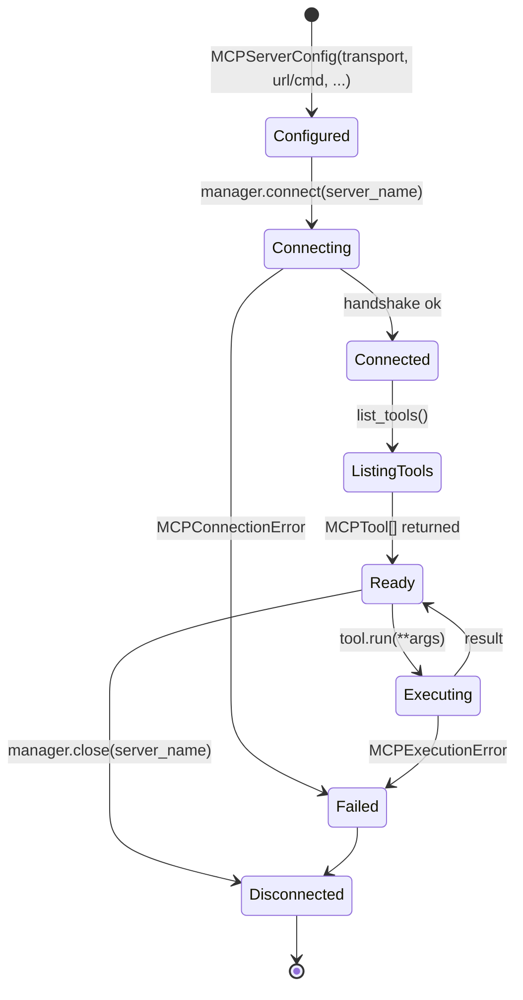

# MCP Tools — Connection Lifecycle

How `MCPConnectionManager` opens, multiplexes, and tears down connections to MCP servers, and how `MCPTool` wraps the resulting tool descriptors.

## Transports

- `MCPTransport.STDIO` — subprocess; command + args.
- `MCPTransport.SSE` / `HTTP` — remote MCP server.

## Lifecycle rules

- **Always close.** Use `async with MCPConnectionManager(...)` or call `await manager.close_all()` in a finally block — leaked stdio subprocesses are a real memory/handle leak.
- **One manager per agent run**, not per tool call. Tools share the manager's connections.
- **Elicitation** flows (multi-turn prompts from the server) come through `BaseElicitationTool` — `is_elicitation` returns True, signaling the agent to suspend the turn for user input.
- Wrap user-facing errors as `MCPError` subclasses (`MCPConfigError`, `MCPConnectionError`, `MCPExecutionError`) — they're caught by the agentic loop.

See `src/echo/tools/mcp_connection_manager.py`, `src/echo/tools/mcp_tool.py`.
